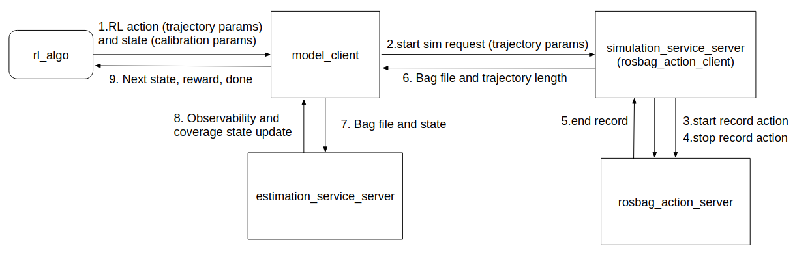

# CoRL 2020: Learn to Calibrate

## 1. Introduction
### 1.1 Project description:
We present a new approach to learn sufficiently informative motions necessary to calibrate a visual-inertial system using deep reinforcement learning. Precise calibration is essential to the applications of visualinertial systems. Typically, it requires performing sophisticated motions in front of a calibration target manually. Our key contribution is to model the calibration process as a partially observable Markov decision process and use deep reinforcement learning to establish a sequence of trajectories performed by a robot arm to collect measurements considering observability, camera coverage, and path length. Our experiments show that it allows us to collect data efficiently that yield desired sensor parameters.

### 1.2 Documents:
* [PLR_Progress_Chen_Ao.pdf](https://github.com/clthegoat/Learn-to-Calibrate/blob/master/Documents/PLR_Progress_Chen_Ao.pdf)
* [Learn to Calibration: RL model for Camera Calibration.pdf](https://github.com/clthegoat/Learn-to-Calibrate/blob/master/Documents/Learn%20to%20Calibration:%20RL%20model%20for%20Camera%20Calibration.pdf)
* [Slides 09.04.2020/16.04.2020](https://docs.google.com/presentation/d/1DPJb24JQD701VRsQbYJ4nKLdskhTotXbzlAWpr1vjmk/edit?usp=sharing)
* [Slides 02.04.2020](https://docs.google.com/presentation/d/1Za7tgKgjiNe5ZtPUaQ1Bm_m_TqmLSi22NiF5j9SeCd0/edit?usp=sharing)
* [PLR_Proposal_Chen_Ao.pdf](https://github.com/clthegoat/Learn-to-Calibrate/blob/master/Documents/PLR_Proposal_Chen_Ao.pdf)

### 1.3 Build Instructions for Ubuntu 18.04 LTS:

*Install required dependencies:*
```
sudo apt-get install ros-melodic-moveit
sudo apt install ros-melodic-libfranka ros-melodic-franka-ros
sudo apt-get install ros-kinetic-moveit-visual-tools
sudo apt-get install build-essential bc curl ca-certificates fakeroot gnupg2 libssl-dev lsb-release libelf-dev bison flex
pip install opencv-python
pip install opencv-contrib-python
pip install --upgrade tensorflow
```

*Clone the repository and catkin build:*
```
cd ~/catkin_ws/src
git clone https://github.com/clthegoat/Learn-to-Calibrate.git
cd ../
catkin build
source ~/catkin_ws/devel/setup.bash
```
(Note: please change the file saving directory in *franka_cal_sim/config/config.yaml* before training!)

### 1.4 Usage:
##### Training:
```
roslaunch franka_cal_sim action_srv_nodelet_checkerboard.launch
```
##### Testing:
```
roslaunch franka_cal_sim test_action_srv_nodelet_checkerboard.launch
```

A video tutorial can be found here:

[](https://drive.google.com/file/d/1GAEddBPQEpjtUcNeU-PW8x6wEEaoCc_R/view?usp=sharing)


### 1.5 Code framework:
#### Without Kalibr


#### With Kalibr



## 2 Development
### 2.1 Timeline:
* April 19: Midterm progress - Students submit their progress report.
* June 08: Final project presentations - Students present their projects in a joint poster session in CLA Building D-floor (12:00 to 14:00).
* June 14: Final project reports - Students submit their final reports for the projects.
* July 07: CoRL-2020 submission deadline.

### 2.2 Change log:
* 20200404: Fix the simulation
* 20201304: Change the camera intrinsic calibration part
* 20201604: Implement RL algorithm.
* 20201904: Midterm Report
* 20202004: Hyperparameter tuning for DDPG

### 2.3 To do:
* Solve the initialization problem of the simulation
* State estimation: Camera-IMU Calibration
* Implement SAC

### 2.4 Useful links:
* [Github repo: Kalibr](https://github.com/ethz-asl/kalibr)
* [Github repo: franka_gazebo](https://github.com/mkrizmancic/franka_gazebo.git)
* [Github repo: panda_moveit_config](https://github.com/erdalpekel/panda_moveit_config)
* [Github repo: franka_ros](https://github.com/erdalpekel/franka_ros)
* [Github repo: panda_simulation](https://github.com/erdalpekel/panda_simulation.git)
* [Github repo: ROS integration for Franka Emika research robots](https://github.com/frankaemika/franka_ros.git)
* [Blog: Integrating FRANKA EMIKA Panda robot into Gazebo](https://erdalpekel.de/?p=55)
* [Can I simulate franka panda in Gazebo #44](https://github.com/frankaemika/franka_ros/issues/44)
* [DE3-Panda-Wall: Running on Gazebo](https://de3-panda-wall.readthedocs.io/en/latest/gazebo_problems.html)
