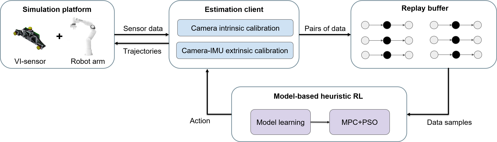

# Learning Trajectories for Visual-Inertial System Calibration via Model-based Heuristic Deep Reinforcement Learning

This repo contains the code for our CoRL 2020 paper. <br> Developed by
[Yunke Ao](https://www.linkedin.com/in/yunke-ao-317325145/) and
[Le Chen](https://github.com/clthegoat) 
from [Autonomous Systems Lab (ASL)](https://asl.ethz.ch/) at [ETH Zurich](https://ethz.ch/en.html).



## 1 Introduction
In this work we present a novel approach to obtain favorable trajectories for visual-inertial system calibration, using model-based deep reinforcement learning. Our key contribution is to model the calibration process as a Markov decision process and then use model-based deep reinforcement learning with particle swarm optimization to establish a sequence of calibration trajectories to be performed by a robot arm.

## 2 Usage

Our code is tested on [Ubuntu 18.04 LTS (Bionic Beaver)](https://releases.ubuntu.com/18.04/) and [ROS Melodic Morenia](http://wiki.ros.org/melodic/Installation/Ubuntu).

### 2.1 Build Instructions

* Install required dependencies:

```
sudo apt-get install ros-melodic-moveit
sudo apt install ros-melodic-libfranka ros-melodic-franka-ros
sudo apt-get install ros-melodic-moveit-visual-tools
sudo apt-get install build-essential bc curl ca-certificates fakeroot gnupg2 libssl-dev lsb-release libelf-dev bison flex
pip install opencv-python
pip install opencv-contrib-python
pip install --upgrade tensorflow
sudo apt-get install python-setuptools python-rosinstall ipython libeigen3-dev libboost-all-dev doxygen libopencv-dev ros-melodic-vision-opencv ros-melodic-image-transport-plugins ros-melodic-cmake-modules software-properties-common software-properties-common libpoco-dev python-matplotlib python-scipy python-git python-pip ipython libtbb-dev libblas-dev liblapack-dev python-catkin-tools libv4l-dev
sudo pip install python-igraph --upgrade
sudo apt-get install build-essential libgtk-3-dev
pip3 install pyyaml
pip3 install rospkg
pip3 install matplotlib
pip3 install pyswarm
```

* Clone the repository and catkin build:

```
cd ~/catkin_ws/src
git clone https://github.com/clthegoat/Learn-to-Calibrate.git
cd ../
catkin build
source ~/catkin_ws/devel/setup.bash
```

### 2.2 Configuration

* Please change the file saving directory in ***franka_cal_sim/config/config.yaml*** before training or testing!

* If you want to train an agent for **camera intrinsic calibration**, please set ***"if_calibrate_intrinsic"** to be **"true"*** in ***src/franka_cal_sim/config/config.yaml***.

* If you want to train an agent for **camera-IMU extrinsic calibration**, please set ***"if_calibrate_intrinsic"*** to be ***"false"*** in ***src/franka_cal_sim/config/config.yaml***.

### 2.3 Camera Intrinsic Calibration

* In terminal 1: start simulation

```
roslaunch franka_cal_sim cam_int_respawn.launch
```

* In terminal 2: start training

```
cd src/franka_cal_sim/python/
python3 MB_PSO_grd_RL_algo_cam.py
```

* After training, you may want to test the agent:

```
cd src/franka_cal_sim/python/
python3 RL_algo_test_cam.py
```

### 2.4 Camera-IMU Extrinsic Calibration

* In terminal 1: start simulation

```
roslaunch franka_cal_sim cam_imu_respawn.launch
```

* In terminal 2: start training

```
cd src/franka_cal_sim/python/
python3 MB_PSO_grd_RL_algo.py
```

* After training, you may want to test the agent:

```
cd src/franka_cal_sim/python/
python3 RL_algo_test.py
```

## 3 Citing

Please cite the [following paper]() when using our code for your research:

```bibtex
@inproceedings{,
 title={Learning Trajectories for Visual-Inertial System Calibration via Model-based Heuristic Deep Reinforcement Learning},
 author={},
 booktitle={Proceedings of the 4th Conference on Robot Learning (CoRL)},
 year={2020},
 month-{November}
}
```


## 4 Code reference:

Our code is based on the following repositories:

* [Kalibr](https://github.com/ethz-asl/kalibr)
* [franka_ros](https://github.com/erdalpekel/franka_ros)
* [panda_moveit_config](https://github.com/erdalpekel/panda_moveit_config)
* [nodelet_rosbag](https://github.com/osrf/nodelet_rosbag.git)
* [rosbag-recorder](https://github.com/chili-epfl/rosbag-recorder.git)
* [image_pipeline](https://github.com/ros-perception/image_pipeline.git)
