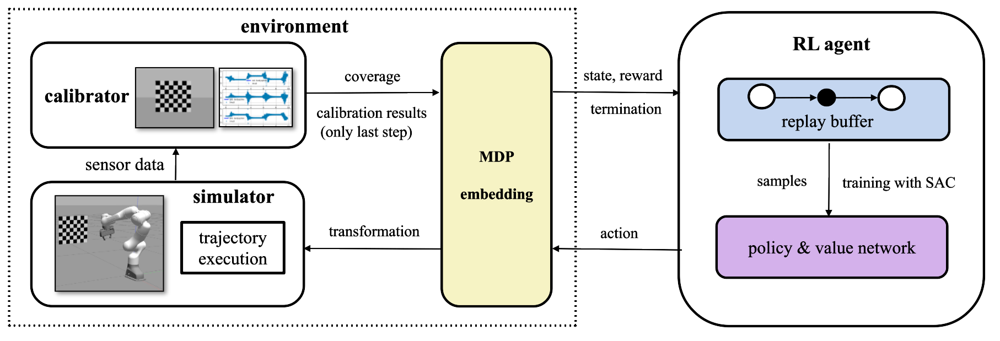

# Unified Data Collection for Visual-Inertial Calibration via Deep Reinforcement Learning

Update:  The lastest code will be updated in this branch. Please switch to [CORL2020](https://github.com/ethz-asl/Learn-to-Calibrate/tree/CoRL2020) branch if you are looking for the Model-based Heuristic Deep RL approach.

Developed by
[Le Chen](https://github.com/clthegoat) and 
[Yunke Ao](https://www.linkedin.com/in/yunke-ao-317325145/) from [Autonomous Systems Lab (ASL)](https://asl.ethz.ch/) at [ETH Zurich](https://ethz.ch/en.html).



## 1 Introduction
In this work we presents a novel formulation to learn a motion policy to be executed on a robot arm for automatic data collection for calibrating intrinsics and extrinsics jointly. Our approach models the calibration process compactly using model-free deep reinforcement learning to derive a policy that guides the motions of a robotic arm holding the sensor to efficiently collect measurements that can be used for both camera intrinsic calibration and camera-IMU extrinsic calibration. Given the current pose and collected measurements, the learned policy generates the subsequent transformation that optimizes sensor calibration accuracy. The evaluations in simulation and on a real robotic system show that our learned policy generates favorable motion trajectories and collects enough measurements efficiently that yield the desired intrinsics and extrinsics with short path lengths. In simulation we are able to perform calibrations $10\times$ faster than hand-crafted policies, which transfers to a real-world speed up of $3\times$ over a human expert.


## 2 Usage

Our code is tested on [Ubuntu 18.04 LTS (Bionic Beaver)](https://releases.ubuntu.com/18.04/) and [ROS Melodic Morenia](http://wiki.ros.org/melodic/Installation/Ubuntu) with GPU GTX 1660 Ti and CUDA 11.2. 

### 2.1 Build Instructions

* Install required dependencies:

```
sudo apt-get install build-essential software-properties-common
sudo apt-get install bc curl ca-certificates fakeroot gnupg2 libssl-dev lsb-release libelf-dev bison flex
sudo apt-get install ros-melodic-moveit, ros-melodic-moveit-visual-tools, ros-melodic-cmake-modules
sudo apt-get install ros-melodic-libfranka ros-melodic-franka-ros, ros-melodic-joint-trajectory-controller
sudo apt-get install ros-melodic-vision-opencv ros-melodic-image-transport-plugins
sudo apt-get install python-setuptools python-rosinstall ipython libeigen3-dev libboost-all-dev doxygen
sudo apt-get install libopencv-dev libgtk-3-dev python-catkin-tools
sudo apt-get install python-matplotlib python-scipy python-git python-pip ipython
sudo apt-get install libtbb-dev libblas-dev liblapack-dev libv4l-dev, libpoco-dev

pip install opencv-python
pip install opencv-contrib-python
pip install --upgrade tensorflow
pip install python-igraph --upgrade
pip install pyyaml
pip install rospkg
pip install matplotlib
pip install pandas
pip install pytorch
pip install wandb
pip install PyKDL
pip install gym
```

* Clone the repository and catkin build:

```
cd ~/catkin_ws
git clone https://github.com/clthegoat/Learn-to-Calibrate.git
cd Learn-to-Calibrate
git checkout master
cd ../
mv Learn-to-Calibrate src
catkin build
source ~/catkin_ws/devel/setup.bash
```

### 2.2 Configuration

* Please change the file saving directory in ***franka_cal_sim_single/config/config.yaml*** before training or testing!

### 2.3 Running the code

#### 2.3.1 Training:

* In terminal 1:

```
source ~/catkin_ws/devel/setup.bash
roslaunch franka_cal_sim_single cam_imu_ext_che.launch
```

* In terminal 2:

```
source ~/catkin_ws/devel/setup.bash
cd src/franka_cal_sim/python/algorithms
python RL_algo_sac_int_ext.py
```

#### 2.3.2 Testing:

* In terminal 1:

```
source ~/catkin_ws/devel/setup.bash
roslaunch franka_cal_sim_single cam_imu_ext_che.launch
```

* In terminal 2:

```
source ~/catkin_ws/devel/setup.bash
cd src/franka_cal_sim/python/test_policies/
python RL_algo_sac_ext_int_test.py
```

## 3 Citing

Please cite the [following paper](https://arxiv.org/abs/2011.02574) when using our code for your research:

```bibtex
@article{chen2020learning,
  title={Learning Trajectories for Visual-Inertial System Calibration via Model-based Heuristic Deep Reinforcement Learning},
  author={Chen, Le and Ao, Yunke and Tschopp, Florian and Cramariuc, Andrei and Breyer, Michel and Chung, Jen Jen and Siegwart, Roland and Cadena, Cesar},
  journal={arXiv preprint arXiv:2011.02574},
  year={2020}
}
```

## 4 Code reference:

Our code is based on the following repositories:

* [Kalibr](https://github.com/ethz-asl/kalibr)
* [franka_ros](https://github.com/erdalpekel/franka_ros)
* [panda_moveit_config](https://github.com/erdalpekel/panda_moveit_config)
* [nodelet_rosbag](https://github.com/osrf/nodelet_rosbag.git)
* [rosbag-recorder](https://github.com/chili-epfl/rosbag-recorder.git)
* [image_pipeline](https://github.com/ros-perception/image_pipeline.git)
* [Soft Actor-Critic](https://github.com/haarnoja/sac.git)